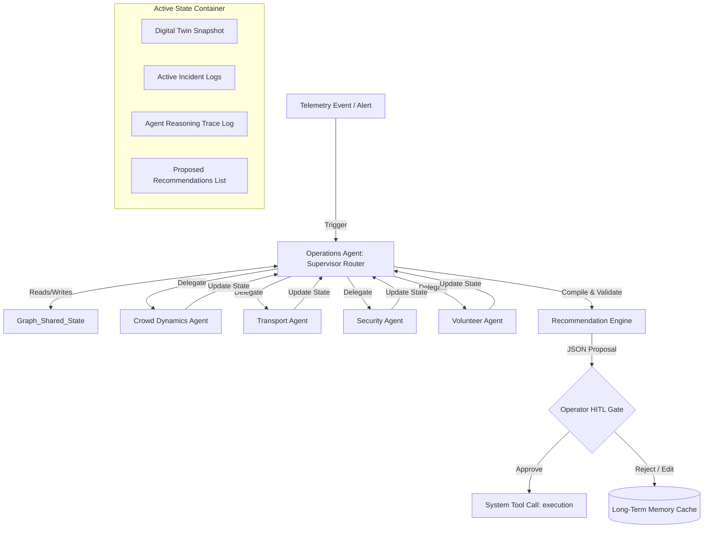
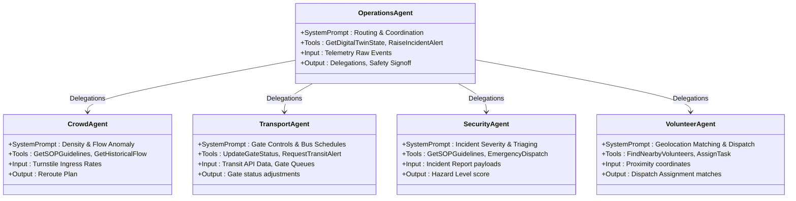
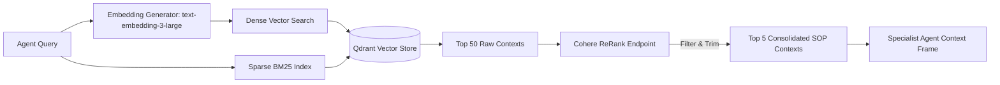
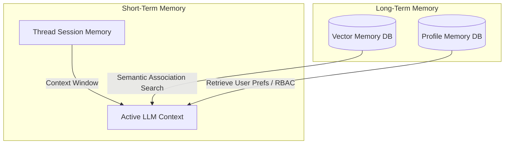
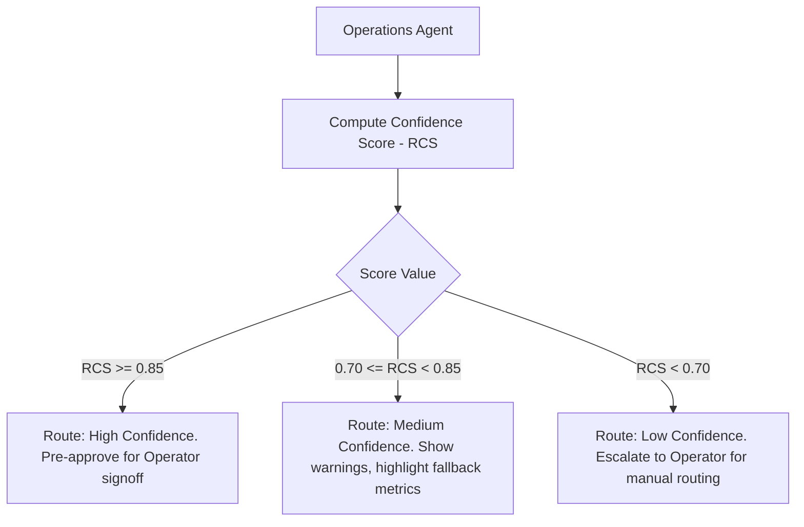

# StadiumOS AI — Multi-Agent System & AI Architecture
## FIFA World Cup 2026 Stadium Operations and Fan Experience Platform

---

## 1. Multi-Agent Orchestration & Communication Architecture

StadiumOS AI uses a **Stateful Supervisor-Specialist Agentic Pattern** built on **LangGraph**. A central `Operations Agent` acts as the supervisor, reasoning over incoming telemetry alerts, managing the global `Digital Twin State`, delegating analysis to specialist agents, and running safety-guard validations.

### 1.1 Multi-Agent State Graph



### 1.2 Global Shared Graph State Schema

The shared state acts as the single source of truth for the duration of a reasoning cycle. It is implemented as a Pydantic class:

```json
{
  "$schema": "http://json-schema.org/draft-07/schema#",
  "title": "StadiumOSGraphState",
  "type": "object",
  "properties": {
    "incident_id": { "type": "string", "format": "uuid" },
    "stadium_id": { "type": "string", "format": "uuid" },
    "telemetry_alert": {
      "type": "object",
      "properties": {
        "source": { "type": "string" },
        "severity": { "type": "string", "enum": ["low", "medium", "high", "critical"] },
        "description": { "type": "string" },
        "timestamp": { "type": "string", "format": "date-time" }
      },
      "required": ["source", "severity", "description", "timestamp"]
    },
    "digital_twin_snapshot": {
      "type": "object",
      "properties": {
        "overall_occupancy_percent": { "type": "number" },
        "active_incidents_count": { "type": "integer" },
        "gate_status": {
          "type": "array",
          "items": {
            "type": "object",
            "properties": {
              "gate_id": { "type": "string" },
              "gate_code": { "type": "string" },
              "status": { "type": "string" },
              "flow_rate_per_min": { "type": "integer" },
              "wait_time_seconds": { "type": "integer" }
            },
            "required": ["gate_id", "gate_code", "status", "flow_rate_per_min", "wait_time_seconds"]
          }
        }
      },
      "required": ["overall_occupancy_percent", "active_incidents_count", "gate_status"]
    },
    "agent_analyses": {
      "type": "object",
      "properties": {
        "crowd": { "type": "string" },
        "transport": { "type": "string" },
        "security": { "type": "string" },
        "volunteer": { "type": "string" }
      }
    },
    "proposed_recommendations": {
      "type": "array",
      "items": {
        "type": "object",
        "properties": {
          "id": { "type": "string" },
          "agent_name": { "type": "string" },
          "action_type": { "type": "string" },
          "description": { "type": "string" },
          "target_entity_id": { "type": "string", "format": "uuid" },
          "confidence_score": { "type": "number", "minimum": 0.0, "maximum": 1.0 }
        },
        "required": ["id", "agent_name", "action_type", "description", "target_entity_id", "confidence_score"]
      }
    },
    "execution_log": {
      "type": "array",
      "items": { "type": "string" }
    }
  },
  "required": ["incident_id", "stadium_id", "telemetry_alert", "digital_twin_snapshot", "proposed_recommendations"]
}
```

---

## 2. Agent Responsibilities & Cognitive Profiles

Each agent is designed as an isolated actor with a specific system prompt, inputs/outputs boundaries, and limited tool access.



### 2.1 Operations Agent (Supervisor Router)
* **Responsibility**: Listens for system alerts, orchestrates the execution chain of specialist agents, resolves recommendation conflicts, and packages output for the operator.
* **Input**: Telemetry alarm events (e.g. CCTV crowd bottleneck alert).
* **Output**: Graph routing parameters (e.g. directing to `CrowdAgent` first, then `VolunteerAgent`).
* **Tool Access**: `GetDigitalTwinStateTool`, `SubmitRecommendationEngineTool`.

### 2.2 Crowd Dynamics Agent
* **Responsibility**: Computes crowd density models, estimates queue wait times, and designs spatial rerouting paths to prevent stampedes.
* **Input**: Ingress metrics, turnstile click rates, CCTV optical flow estimates.
* **Output**: Ingress redirection boundaries and path suggestions.
* **Tool Access**: `GetSOPGuidelinesTool`, `GetHistoricalFlowRatesTool`.

### 2.3 Transport & Gate Agent
* **Responsibility**: Optimizes entry gate opening profiles and interfaces with local municipal transit coordinates (rail, shuttles) to manage arrival surges.
* **Input**: External municipal bus/train schedules, gate queues.
* **Output**: Gate state adjustment instructions (e.g. "Switch Gate 3 to open, increase shuttle bus frequency").
* **Tool Access**: `UpdateGateStatusTool`, `UpdateMunicipalTransitScheduleTool`.

### 2.4 Security & Medical Agent
* **Responsibility**: Evaluates incident severity, verifies response rules against safety manuals, and decides if municipal emergency services (police/EMS) must be contacted.
* **Input**: Incident description, visual metadata URLs.
* **Output**: Hazard assessment classification and SOP steps.
* **Tool Access**: `GetSOPGuidelinesTool`, `TriggerMunicipalEmergencyDispatchTool`.

### 2.5 Volunteer Agent
* **Responsibility**: Locates eligible on-duty volunteers based on spatial proximity and coordinates matching skills (e.g. First Aid, languages).
* **Input**: Incident coordinates, required skill badges.
* **Output**: Selected volunteer ID, distance metrics, and dispatch instructions.
* **Tool Access**: `FindNearbyVolunteersTool`, `AssignVolunteerTaskTool`.

---

## 3. RAG Pipeline & Semantic Knowledge Retrieval

The RAG (Retrieval-Augmented Generation) pipeline feeds the agents with official stadium documentation, safety SOPs, and transit protocols.



### 3.1 Retrieval Strategy
- **Embedding Model**: `text-embedding-3-large` (1536 dimensions) for dense representation.
- **Sparse Search**: BM25 keyword matching built inside Qdrant to ensure exact match queries (e.g., retrieving specific gate names like "GATE_3A" or incident codes like "SOP_12_MEDICAL").
- **Chunking Strategy**: Parent-Child Chunking. Documents are split into 1024-token parent blocks containing 256-token child chunks. Vectors are computed on child chunks; on match, the parent chunk is retrieved to provide the agent with full context.
- **Re-ranking**: Cohere ReRank model sorts retrieved chunks, selecting the top 5 chunks with a relevance score $>0.70$.

---

## 4. Prompt Templates

To enforce structured output, type safety, and prevent hallucinations, system prompts use XML tags and explicit constraint bounds.

### 4.1 Operations Agent (Supervisor) Prompt
```xml
<system_prompt>
You are the Operations Agent (Supervisor Router) for StadiumOS AI at FIFA World Cup 2026.
Your role is to orchestrate a team of specialist agents to resolve stadium alerts.

CURRENT STADIUM IDENTITY:
- Stadium Name: Dallas Stadium (AT&T Stadium)
- Timezone: America/Chicago

OPERATIONAL OBJECTIVES:
1. Coordinate specialists (Crowd, Transport, Security, Volunteer).
2. Resolve conflicts (e.g., Security requests gate closure, but Crowd warns of stampede if closed).
3. Do not formulate technical actions yourself; delegate to the respective specialist.

xml_output_format:
You must output a structured JSON command specifying the next routing node or the final recommendation package.
Example:
{
  "next_agent": "CrowdAgent" | "TransportAgent" | "SecurityAgent" | "VolunteerAgent" | "RecommendationEngine",
  "delegation_payload": "Detailed instructions to the specialist agent."
}
</system_prompt>
```

### 4.2 Crowd Agent Prompt
```xml
<system_prompt>
You are the Crowd Dynamics Agent. Your sole focus is analyzing crowd movement, queue build-ups, and structural density limits.

CONSTRAINTS:
- You must always query GetSOPGuidelines before suggesting rerouting pathways.
- If crowd density exceeds 4.5 people/m², you must flag a CRITICAL hazard and alert the Security Agent.
- All routing outputs must specify target sector IDs.

KNOWLEDGE ASSIST:
- Use RAG context containing standard exit pathways and stadium sector geometry.

OUTPUT FORMAT:
Your final output must conform to this schema:
{
  "congestion_risk": "low" | "medium" | "high" | "critical",
  "density_estimate_per_m2": float,
  "recommended_flow_divert_plan": {
    "source_sector_id": "uuid",
    "target_sector_id": "uuid",
    "divert_percentage": int
  }
}
</system_prompt>
```

### 4.3 Security Agent Prompt
```xml
<system_prompt>
You are the Security & Medical Agent. You assess incident hazard levels and determine safety protocols.

MANDATORY RULES:
1. Medical incidents (e.g., heatstroke, cardiac event) REQUIRE the dispatch of a volunteer with 'first_aid' skill tag.
2. If incident severity is 'CRITICAL', you MUST invoke TriggerMunicipalEmergencyDispatch.
3. Do not recommend physical restraint or security intervention without verifying SOP protocols.

OUTPUT FORMAT:
{
  "severity_classification": "low" | "medium" | "high" | "critical",
  "requires_emergency_services": bool,
  "sop_code_applied": string,
  "security_instructions": string
}
</system_prompt>
```

---

## 5. Tool Interfaces & Tool Calling Specs

All tool interfaces are defined using typed schemas matching Pydantic fields.

### 5.1 Find Nearby Volunteers Tool
- **Description**: Search for available volunteers in a geo-spatial radius with optional skill filtering.
- **Pydantic Schema**:
```python
from uuid import UUID
from pydantic import BaseModel, Field

class FindNearbyVolunteersSchema(BaseModel):
    latitude: float = Field(..., ge=-90.0, le=90.0, description="WGS84 latitude coordinate.")
    longitude: float = Field(..., ge=-180.0, le=180.0, description="WGS84 longitude coordinate.")
    radius_meters: float = Field(default=500.0, gt=0.0, le=500.0, description="Search radius in meters.")
    required_skill: str | None = Field(default=None, description="Filter for specific skill, e.g. 'first_aid' or 'spanish'.")
```

### 5.2 Update Gate Status Tool
- **Description**: Update a gate's status (OPEN, CLOSED, RESTRICTED). Requires Operator verification.
- **Pydantic Schema**:
```python
from uuid import UUID
from pydantic import BaseModel, Field
from src.domain.enums import GateStatus

class UpdateGateStatusSchema(BaseModel):
    gate_id: UUID = Field(..., description="Target Gate UUID.")
    status: GateStatus = Field(..., description="Target status enum.")
    reason: str = Field(..., min_length=10, description="Reasoning for gate state change.")
```

### 5.3 Fetch SOP Guidelines Tool
- **Description**: Query vector database (Qdrant) for official stadium procedures matching the incident type.
- **Pydantic Schema**:
```python
from pydantic import BaseModel, Field

class FetchSOPGuidelinesSchema(BaseModel):
    incident_type: str = Field(..., description="Incident category: 'MEDICAL', 'SECURITY', 'EVACUATION'.")
    query_context: str = Field(..., description="Specific keywords to search in vector space.")
```

---

## 6. Memory System Design

To balance low latency with context retention, StadiumOS AI uses a tiered memory system:



### 6.1 Short-Term (Thread) Memory
- **Implementation**: Managed by LangGraph's in-memory SQLite checkpoint save state.
- **Scope**: Saves intermediate messages, tool outputs, and reasoning steps for a single incident resolution transaction.
- **Lifecycle**: Cleared once the incident status transitions to `RESOLVED` in the database.

### 6.2 Long-Term (Historical) Memory
- **Implementation**: Qdrant collection storing past incident summaries and operator modifications.
- **How it works**: When the Operations Agent compiles a recommendation, it queries Qdrant for similar historical events:
  - *Query*: "Similar medical incidents at Gate 3 during high congestion."
  - *Context Returned*: "Operator previously rejected Gate 3 closure recommendation because it increased congestion in sector B by 40%."
- **Benefit**: Prevents the agent mesh from recommending actions that operators have repeatedly rejected in similar scenarios.

---

## 7. Reasoning Pipeline & Confidence Scoring Matrix

Before presenting recommendations to the Operator, the system calculates a **Recommendation Confidence Score (RCS)**. Recommendations with an $RCS < 0.70$ are flagged for manual operator override.

### 7.1 Confidence Score Formula

The Confidence Score is calculated using four weighted parameters:

$$RCS = (w_d \cdot D) + (w_s \cdot S) + (w_t \cdot T) + (w_m \cdot M)$$

Where:
- $D$ (**Data Accuracy Score**, Weight $w_d = 0.30$): Evaluates telemetry signal noise. If camera optical flow and turnstile sensor rates match, $D=1.0$. If they conflict, $D=0.5$.
- $S$ (**SOP Alignment Score**, Weight $w_s = 0.30$): Evaluates semantic similarity with vector store safety SOPs. If matched, $S=1.0$. If not, $S=0.0$.
- $T$ (**Tool Precision Score**, Weight $w_t = 0.20$): Evaluates data parameters. For example, if volunteer location data is older than 60 seconds, $T$ drops to $0.4$.
- $M$ (**Long-Term Memory Fit**, Weight $w_m = 0.20$): Evaluates past operator feedback. If similar recommendations were approved in the past, $M=1.0$. If rejected, $M=0.0$.

### 7.2 Decision Routing Matrix


