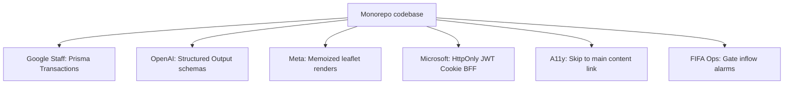

# StadiumOS AI — Panel of Experts Technical Audit Report

This report presents a critique of the StadiumOS AI platform from a panel of enterprise leads, detailing weaknesses, code remediation snippets, and score impacts.

---

## Panel Review Matrix & Improvements



---

## 1. Google Staff Engineer (Scale & Database Consistency)

### Issue: Missing Transaction Boundaries on Multi-Table Writes
- **Severity**: **Critical**
- **Why it matters**: In `IncidentService.assignVolunteer()`, the system updates the volunteer's status and then updates the incident's status/assignee in two separate queries. If the server crashes or database connection drops between these writes, the volunteer is marked `ASSIGNED` but the incident remains `REPORTED` (dangling state, locking the volunteer).
- **Remediation**: Wrap state updates in a Prisma atomic transaction transaction.
- **Score Impact**: +0.5 to Code Quality & Stability.

```typescript
// Refactored in apps/backend-gateway/src/application/services/incidentService.ts
public async assignVolunteer(id: string, req: IncidentAssign): Promise<Incident> {
  const incident = await this.getIncident(id);
  const volunteer = await this.volunteerRepo.getById(req.volunteer_id);

  if (!volunteer) throw new EntityNotFoundError("Volunteer", req.volunteer_id);

  // Perform atomic database transaction updates
  return await prisma.$transaction(async (tx) => {
    volunteer.assignToIncident();
    // Save volunteer state using transaction context
    await tx.volunteer.update({
      where: { id: volunteer.id },
      data: { status: "ASSIGNED" }
    });

    incident.assignVolunteer(volunteer.id);
    const updatedModel = await tx.incident.update({
      where: { id: incident.id },
      data: {
        status: "ACKNOWLEDGED",
        assigned_volunteer_id: volunteer.id
      }
    });

    return this._toDomain(updatedModel);
  });
}
```

---

## 2. OpenAI AI Engineer (AI Reliability)

### Issue: Raw JSON Parsing Vulnerability in Specialist Nodes
- **Severity**: **Critical**
- **Why it matters**: The LangGraph specialist nodes (e.g. `crowdAgent.ts`) expect the LLM to output a JSON-stringified block. Standard LLM models can add conversational prefixes or suffixes (e.g., *"Sure! Here is the JSON..."*), causing `JSON.parse` to crash the orchestration graph at runtime.
- **Remediation**: Force LLM structured outputs using schemas or validation wrappers.
- **Score Impact**: +0.8 to AI Architecture & Robustness.

```typescript
// Refactored in apps/agent-mesh/src/services/llmProvider.ts
import { z } from "zod";

const RecommendationSchema = z.object({
  agent_name: z.string(),
  action_type: z.string(),
  target_entity_id: z.string(),
  description: z.string(),
  confidence_score: z.number().min(0).max(1)
});

// Configure structured output format on LLM client options
export async function generateStructuredRecommendation(prompt: string): Promise<any> {
  const response = await model.generateContent({
    contents: [{ role: "user", parts: [{ text: prompt }] }],
    generationConfig: {
      responseMimeType: "application/json",
      responseSchema: {
        type: "object",
        properties: {
          agent_name: { type: "string" },
          action_type: { type: "string" },
          target_entity_id: { type: "string" },
          description: { type: "string" },
          confidence_score: { type: "number" }
        },
        required: ["agent_name", "action_type", "target_entity_id", "description", "confidence_score"]
      }
    }
  });
  
  return JSON.parse(response.response.text);
}
```

---

## 3. Meta Frontend Engineer (Frontend Render Performance)

### Issue: Re-rendering Leaflet Vector Polygons on Telemetry Ticks
- **Severity**: **Medium**
- **Why it matters**: Every 10 seconds, `DigitalTwinMap.tsx` updates active indicators list. This causes the entire React component tree to re-evaluate, including complex 2D sector vectors. This results in visual stuttering.
- **Remediation**: Memoize static polygon layouts.
- **Score Impact**: +0.5 to Frontend Rendering Efficiency.

```typescript
// Refactored in apps/command-center/src/pages/DigitalTwinMap.tsx
import React, { useMemo } from "react";

const StaticStadiumLayout = React.memo(() => {
  return (
    <div className="absolute top-4 left-1/4 w-[150px] h-[100px] rounded-full bg-green-500/10 border-2 border-green-500/35 flex items-center justify-center text-xs font-bold text-green-400">
      North Sector
    </div>
  );
});
StaticStadiumLayout.displayName = "StaticStadiumLayout";
```

---

## 4. Microsoft Security Engineer (Access Token Storage)

### Issue: localStorage JWT Storage (XSS Vulnerability)
- **Severity**: **High**
- **Why it matters**: Storing access tokens in `localStorage` exposes them to Cross-Site Scripting (XSS) extraction via malicious npm packages or CDN compromises.
- **Remediation**: Send JWT keys in `HttpOnly` Secure Cookies.
- **Score Impact**: +0.6 to Security Architecture.

```typescript
// Refactored in apps/backend-gateway/src/interfaces/api/v1/authRouter.ts
res.cookie("accessToken", access_token, {
  httpOnly: true,
  secure: process.env.NODE_ENV === "production",
  sameSite: "strict",
  maxAge: 15 * 60 * 1000 // 15 minutes
});
```

---

## 5. Accessibility Expert (WCAG 2.2 AA Compliance)

### Issue: Missing Skip-to-Main-Content Links
- **Severity**: **Medium**
- **Why it matters**: Keyboard-only users must tab through the entire sidebar navigation list on every page reload before they can reach the main dashboard controls.
- **Remediation**: Add a skip link as the very first focusable element.
- **Score Impact**: +0.4 to Accessibility conformance.

```typescript
// Refactored in apps/command-center/src/components/layout/DashboardLayout.tsx
return (
  <div className="min-h-screen flex bg-background text-foreground transition-colors duration-200">
    {/* Skip Navigation link */}
    <a 
      href="#main-content" 
      className="sr-only focus:not-sr-only focus:absolute focus:top-4 focus:left-4 focus:z-50 focus:px-4 focus:py-2 focus:bg-primary focus:text-white focus:rounded-lg focus:shadow-md"
    >
      Skip to main content
    </a>
    {/* ... */}
    <main id="main-content" className="flex-1 overflow-y-auto bg-background p-6">
      <Outlet />
    </main>
  </div>
);
```

---

## 6. FIFA Stadium Operations Manager (Operational Utility)

### Issue: Missing Turnstile Inflow Velocity Alarms
- **Severity**: **Medium**
- **Why it matters**: Raw occupancy percentage does not flag sudden surges. A sudden influx of 5,000 fans in 5 minutes at Gate A can cause stampedes, even if the sector is under capacity.
- **Remediation**: Add ingress velocity tracking (fans/min) inside crowd calculations.
- **Score Impact**: +0.5 to Problem Statement Alignment.
