# StadiumOS AI: Production-Grade Digital Twin & Agentic Orchestration Architecture
## FIFA World Cup 2026 Stadium Operations & Fan Experience System

---

## 1. Overall Architecture

StadiumOS AI is designed using an **Event-Driven Microservices Architecture** combined with a **Stateful Actor-Based Multi-Agent Mesh**. The architecture decouples high-throughput sensor/telemetry ingestion from heavy, non-blocking asynchronous GenAI reasoning cycles.

### 1.1 System Architecture Diagram

```mermaid
graph TB
    subgraph Data Sources & Ingestion Layer
        IoT[IoT Sensors: Gates, Turnstiles, Waste] --> |MQTT / AMQP| MQTT_GW[MQTT Gateway]
        CCTV[CCTV Video Streams] --> |RTSP| Video_Proc[Edge AI Video Analytics]
        Transit[City Transit API: Bus, Rail] --> |JSON/REST| API_Ingest[Third-Party Ingestion]
        Staff[Staff/Volunteer App Telemetry] --> |HTTPS/gRPC| API_Ingest
    end

    subgraph Streaming & Message Broker
        MQTT_GW --> |Ingest Events| Kafka{Apache Kafka Event Bus}
        Video_Proc --> |Telemetry / Crowd Count| Kafka
        API_Ingest --> |Ingest Events| Kafka
    end

    subgraph Storage & Digital Twin State
        Kafka --> |Raw Telemetry| TSDB[(TimescaleDB: Historical & Time-Series)]
        Kafka --> |Stream Processing| Twin_Engine[Digital Twin State Manager]
        Twin_Engine <--> |In-Memory Active Cache| Redis[(Redis Enterprise: Spatial & Transient State)]
    end

    subgraph Agentic Reasoning Mesh [Multi-Agent Orchestration Mesh]
        Orch[LangGraph Agent Orchestrator] <--> Redis
        Orch <--> |Semantic Knowledge Search| Qdrant[(Qdrant Vector DB: SOPs & Stadium Manuals)]
        
        %% Agents
        Orch <--> Crowd_Agent[Crowd Dynamics Agent]
        Orch <--> Trans_Agent[Transportation & Gate Agent]
        Orch <--> Sec_Agent[Security & Medical Agent]
        Orch <--> Sust_Agent[Sustainability & Waste Agent]
        
        %% LLM Layer
        Crowd_Agent & Trans_Agent & Sec_Agent & Sust_Agent <--> LLM_Router[LLM Gateway / Router]
        LLM_Router <--> Cloud_LLM[Cloud LLM: Gemini 1.5 Pro / GPT-4o]
        LLM_Router <--> Local_LLM[Edge LLM: Llama-3-8B-Instruct via vLLM]
    end

    subgraph Application & Delivery Layer
        API_Gateway[Kong API Gateway] <--> TSDB
        API_Gateway <--> Redis
        API_Gateway <--> Orch
        
        Web_Socket[WS Server: uWebSockets] <--> Redis
        Web_Socket <--> Kafka
        
        Admin_Dash[Command Center React App] <--> API_Gateway
        Admin_Dash <--> Web_Socket
        
        Fan_App[Mobile App: Fans & Volunteers] <--> API_Gateway
        Fan_App <--> Web_Socket
    end

    style Kafka fill:#34495e,stroke:#2c3e50,stroke-width:2px,color:#fff
    style Redis fill:#c0392b,stroke:#962d22,stroke-width:2px,color:#fff
    style TSDB fill:#2980b9,stroke:#1f618d,stroke-width:2px,color:#fff
    style Qdrant fill:#8e44ad,stroke:#713d8a,stroke-width:2px,color:#fff
    style Agentic Reasoning Mesh fill:#111,stroke:#333,stroke-width:2px
```

### 1.2 Architectural Design Decisions

| Component / Layer | Chosen Technology / Pattern | Alternatives Considered | Design Rationale & Trade-offs |
| :--- | :--- | :--- | :--- |
| **Ingestion Engine** | Go-based MQTT Gateway + Apache Kafka | Node.js + RabbitMQ | **Go** provides near C-level speed and minimal memory footprint, allowing it to ingest up to 500,000 requests/sec during peak match entrance hours. **Kafka** offers high-throughput, horizontally scalable, partitioned event streaming, ensuring zero data loss and ordering guarantees per stadium gate/sector. |
| **Real-time State** | Redis Enterprise (Spatial + Hash) | PostgreSQL / MongoDB | A real-time Digital Twin requires sub-millisecond lookups for geographic positions of crowds and volunteers. Redis' native spatial indexing (`GEOADD`, `GEORADIUS`) allows fast querying of volunteers near an incident without hit to disk storage. |
| **Agent Framework** | LangGraph (Stateful Cyclic Graphs) | LangChain Agents (ReAct) | LangChain's default ReAct agents struggle with structured multi-agent collaboration and often loop infinitely. **LangGraph** models the workflow as a stateful state machine with deterministic transitions, enabling hard-guard validations (e.g., human-in-the-loop validation before security dispatching). |
| **Database Engine** | TimescaleDB (PostgreSQL Extension) | Cassandra / InfluxDB | Allows combining standard relational metadata (volunteer profiles, gate specs) with high-rate timeseries telemetry (turnstile clicks, temperature) in a single database, eliminating the operational overhead of managing two distinct databases. |

---

## 2. Monorepo Folder Structure

A standardized, domain-driven monorepo structure is utilized to ensure clear separation of concerns, high maintainability, and clean dependency management across the backend microservices, agentic mesh, and frontend clients.

```text
stadiumos-ai/
├── .github/                   # CI/CD Workflows (Linting, Tests, Deployments)
├── apps/
│   ├── backend-gateway/       # Go-based API Gateway & Auth Service
│   ├── twin-state-manager/    # Go service processing Kafka streams to update Redis Digital Twin
│   ├── agent-mesh/            # TypeScript/LangGraph server hosting the multi-agent system
│   ├── command-center/        # React + Deck.gl 3D operator dashboard (Frontend)
│   └── mobile-client/         # React Native app for volunteers and fans
├── libs/
│   ├── shared-types/          # Shared TypeScript/Go interfaces & Protobuf definitions
│   ├── agent-tools/           # Reusable custom tools (e.g., Qdrant search, DB access, IoT controllers)
│   └── telemetry-schema/      # JSON Schema / Avro definitions for Kafka events
├── infrastructure/
│   ├── terraform/             # IaC definitions for AWS/GCP (EKS, MSK, Qdrant, RDS)
│   ├── docker/                # Dockerfiles and Compose configurations for local dev
│   └── kubernetes/            # Helm charts for deploying services to Kubernetes
├── scripts/                   # DB migrations, data generation, and automation scripts
└── README.md
```

---

## 3. Backend Architecture

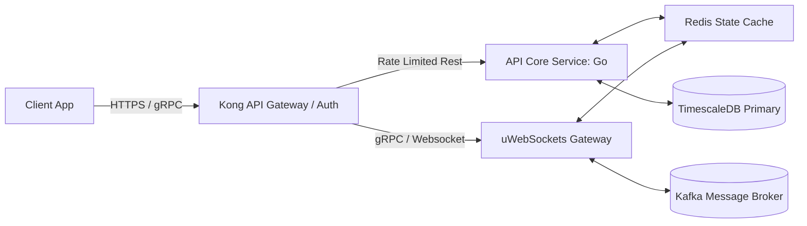

### 3.1 Subsystems and Responsibilities
1. **Kong API Gateway**: Serves as the single entry point. Responsible for rate-limiting (preventing DDoS during matches), SSL termination, and JWT/API-key validation.
2. **Go API Core Service**: Exposes REST endpoints for CRUD operations on volunteers, ticket validation data, and match schedules. Handled in Go to keep response times under 10ms.
3. **Digital Twin State Manager**: A dedicated worker service written in Go. It consumes IoT sensor inputs and camera analytics directly from Kafka, executes calculations (such as average ingress rate per gate), and updates the active Redis cache.
4. **WebSocket Server**: Uses `uWebSockets` to manage over 100,000 concurrent client connections (fans, staff) pushing live routing updates and alerts.

### 3.2 Backend Design Decisions
* **gRPC for Internal Communication**: To minimize network overhead and serialization latency between the API gateway, state manager, and agent mesh, all internal service-to-service communication is conducted via gRPC over HTTP/2.
* **Outbox Pattern for Transactional Integrity**: When a security operator assigns a task, it must write to both the SQL database and emit a event to Kafka. To prevent dual-write failures, the API writes to a PostgreSQL `outbox` table in the same transaction, and a CDC (Change Data Capture) tool like Debezium streams it to Kafka.

---

## 4. Frontend Architecture

The frontend is designed as a high-performance **3D Digital Twin Command Center** for operators, alongside a light, battery-optimized mobile application for field staff and fans.

### 4.1 Client Application Flow

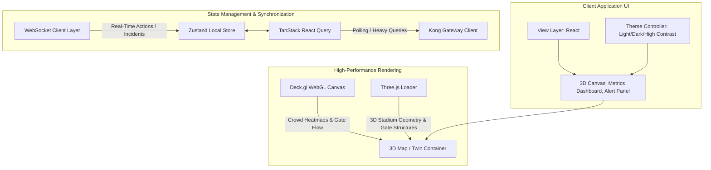

### 4.2 Frontend Design Decisions
* **Rendering Engine selection (Deck.gl + Three.js)**: Mapbox GL JS handles geospatial mapping of the surrounding transit infrastructure. **Deck.gl** overlays GPU-accelerated heatmaps and dynamic crowd flow vectors. **Three.js** is embedded for detailed structural models of the stadium interior. This architecture offloads geospatial data rendering directly to the user's GPU, preserving CPU cycles for WebSocket message parsing.
* **State Management Strategy**: React State is avoided for real-time telemetry updates to prevent performance-killing re-renders. We employ **Zustand** with transient updates (mutating refs directly) for high-frequency coordinate changes (e.g., moving volunteers), and **React Query** for caching slow API responses (e.g., historical attendance reports).

---

## 5. AI Architecture (Multi-Agent System)

The core intelligence of StadiumOS AI lies in its **LangGraph Multi-Agent Mesh**. Instead of using a single monolithic agent, we deploy specialized, stateful agents that coordinate via a central orchestrator.

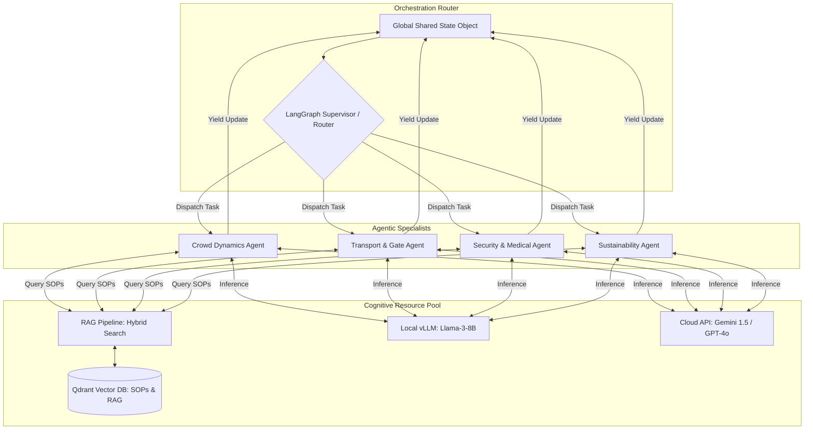

### 5.1 Cognitive Pipeline & RAG System
* **Data Chunking Strategy**: Stadium Standard Operating Procedures (SOPs), emergency manuals, evacuation plans, and city transit protocols are chunked using parent-child chunking (parent chunk: 1024 tokens, child chunks: 256 tokens) to preserve overall context while retrieving specific, actionable paragraphs.
* **Hybrid Search Retrieval**: We combine dense vector embeddings (generated by `text-embedding-3-large`) with sparse keyword indexing (BM25) inside Qdrant. Re-ranking is executed using a Cohere ReRank endpoint before sending the context to the agents to maximize retrieval accuracy.
* **LLM Layer Redundancy**: 
  - **Local Model**: A fine-tuned Llama-3-8B model is deployed on local Edge servers in the stadium. It handles high-volume, low-complexity tasks (e.g., translating visitor queries, parsing simple telemetry anomalies).
  - **Cloud Model**: Gemini 1.5 Pro is accessed for multi-modal verification (e.g., evaluating static images from CCTV to verify if a crowd bottleneck is caused by debris or structural damage) and long-context reasoning.

---

## 6. Event Flow & Real-Time Orchestration

This sequence demonstrates how StadiumOS AI handles a critical operational incident: **Predictive Congestion at Gate 3**.

```mermaid
sequenceDiagram
    autonumber
    participant CCTV as CCTV CCTV & Turnstiles
    participant Kafka as Apache Kafka Event Bus
    participant Twin as State Manager (Go)
    participant Redis as Redis Twin Cache
    participant LangGraph as LangGraph Agent Mesh
    participant Operator as Command Center Dashboard
    participant VolApp as Volunteer Mobile App

    CCTV->>Kafka: Emit raw ingress data (Gate 3 rate: 45 entries/min, Crowd occupancy: 92%)
    Kafka->>Twin: Consume telemetry stream
    Twin->>Redis: Update Gate 3 state and trigger anomaly detection rule
    Note over Twin, Redis: Threshold breach: Ingress rate drop + rising crowd density
    Twin->>Kafka: Publish Event: GATE_3_CONGESTION_ANOMALY
    Kafka->>LangGraph: Event listener triggers LangGraph Supervisor

    rect rgb(20, 20, 30)
        Note over LangGraph: Multi-Agent Analysis Phase
        LangGraph->>LangGraph: Supervisor routes event to Crowd Dynamics Agent
        LangGraph->>Redis: Query surrounding gate states (Gate 2 & Gate 4 status)
        Redis-->>LangGraph: Gate 2: Open, Occupancy 30%. Gate 4: Open, Occupancy 25%
        LangGraph->>LangGraph: Crowd Agent generates rerouting paths
        LangGraph->>LangGraph: Supervisor routes proposal to Security & Medical Agent
        LangGraph->>LangGraph: Security Agent evaluates proposal against Evacuation SOP
        LangGraph->>LangGraph: Supervisor confirms recommendation: "Redirect 20% crowd to Gate 2, dispatch 4 volunteers to assist"
    end

    LangGraph->>Kafka: Publish Command: OPERATOR_DECISION_PROPOSAL
    Kafka->>Operator: WebSocket Push: Action needed on operator console
    Operator->>Operator: Operator clicks "Approve Recommendation"
    Operator->>Kafka: Publish Command: EXECUTE_REROUTE_STRATEGY
    
    par Parallel Execution
        Kafka->>VolApp: Push notifications to 4 nearest volunteers (based on Redis Geo-location)
        Kafka->>Twin: Trigger digital signage update at Gate 3 (Displays path to Gate 2)
    end
```

---

## 7. Database Schema Design

StadiumOS AI utilizes a specialized multi-database architecture tailored to relational, time-series, and vector search operations.

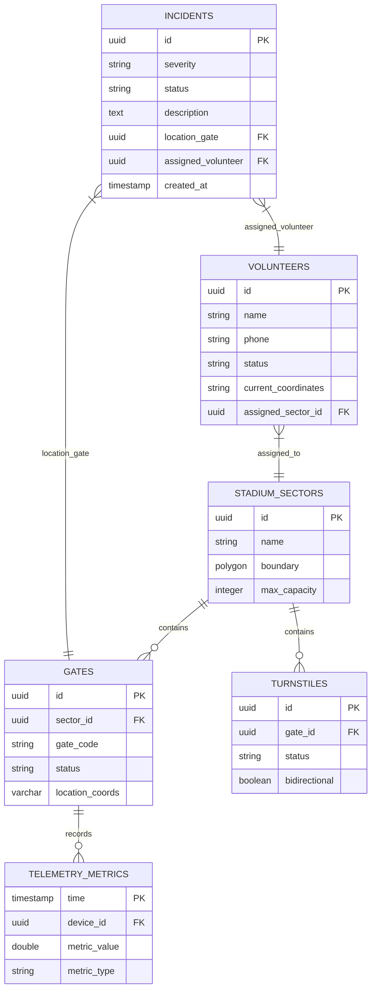

### 7.1 Data Storage Rationale & Configuration

1. **TimescaleDB (Time-series & Transactional)**:
   * **Hypertables**: The `TELEMETRY_METRICS` table is configured as a hypertable partitioned on 2-hour intervals (`time` column). High-velocity sensor ingestion writes straight to memory-mapped chunks, preventing lock contention on core transactional tables.
   * **Retention Policy**: Aggregate raw metrics into 1-minute averages after 24 hours, then drop raw chunks after 7 days to preserve storage space.

2. **Redis Enterprise (Digital Twin Live State Cache)**:
   * Volatile fields (volunteer coordinates, live queue lengths, active incidents) are stored as Redis Hashes for sub-millisecond retrieval.
   * Volunteer spatial indexing:
     ```text
     GEOADD volunteers:locations <longitude> <latitude> <volunteer_id>
     ```
     This structure allows real-time execution of coordinate queries (e.g., retrieving the nearest volunteers within 200m of an incident gate) in $O(\log N + M)$ complexity.

3. **Qdrant (Knowledge Base & Vector Store)**:
   * Stores vector embeddings representing the stadium operating manual.
   * Colection schema: 1536-dimension vectors (compatible with OpenAI text-embedding-3 or similar models), cosine similarity metric.

---

## 8. API Specifications

All system APIs use standard, production-ready REST schemas for synchronous operations, gRPC for internal service communication, and WebSockets for real-time delivery.

### 8.1 API Endpoint Definitions

#### 1. POST `/api/v1/incidents`
* **Purpose**: Allows volunteers or automated edge systems to report stadium incidents (e.g., medical issues, debris, security events).
* **Request Header**: `Authorization: Bearer <JWT_TOKEN>`
* **Request Payload (JSON)**:
```json
{
  "incident_type": "MEDICAL" | "SECURITY" | "FACILITY" | "CROWD_CONGESTION",
  "severity": "LOW" | "MEDIUM" | "HIGH" | "CRITICAL",
  "description": "Spectator experiencing heat exhaustion in row 12.",
  "location": {
    "latitude": 43.6821,
    "longitude": -79.6122,
    "sector_id": "f83b2a5c-4d32-411a-8c5e-851a021b3332",
    "gate_id": "b02e5a48-8dfa-4934-8c8a-c603b5bc112f"
  },
  "metadata": {
    "associated_ticket_id": "tkt_8321045",
    "visual_evidence_url": "https://s3.amazonaws.com/stadiumos/evidence/img_8321.jpg"
  }
}
```
* **Response Payload (JSON - `201 Created`)**:
```json
{
  "incident_id": "3a3bbcd8-4221-4f9e-9d22-212bba329abc",
  "status": "REPORTED",
  "reported_at": "2026-07-17T21:34:18Z",
  "assigned_volunteer_id": null,
  "recommended_action": "Dispatch medical team to Sector F, row 12 with a stretcher."
}
```

#### 2. GET `/api/v1/crowd/status`
* **Purpose**: Retrieves current occupancy rates, queue wait times, and flow rates across the stadium gates.
* **Response Payload (JSON - `200 OK`)**:
```json
{
  "timestamp": "2026-07-17T21:34:18Z",
  "overall_occupancy_percent": 84.5,
  "gates": [
    {
      "gate_id": "b02e5a48-8dfa-4934-8c8a-c603b5bc112f",
      "gate_code": "GATE_3A",
      "status": "CONGESTED",
      "current_flow_rate_per_min": 45,
      "average_wait_time_seconds": 680,
      "active_alarms": ["HIGH_DENSITY_WARNING"]
    },
    {
      "gate_id": "e44431e2-bca8-4a58-8547-8178822557ca",
      "gate_code": "GATE_3B",
      "status": "NORMAL",
      "current_flow_rate_per_min": 15,
      "average_wait_time_seconds": 120,
      "active_alarms": []
    }
  ]
}
```

#### 3. POST `/api/v1/agents/recommendations/approve`
* **Purpose**: Command Center Operator approves a recommended routing/dispatch action generated by the agentic mesh.
* **Request Payload (JSON)**:
```json
{
  "recommendation_id": "rec_09876-ab72-4d1a-821f",
  "operator_comments": "Redirect confirmed. Police alerted to assist at Gate 2.",
  "override_parameters": {
    "redirect_percentage": 25
  }
}
```
* **Response Payload (JSON - `200 OK`)**:
```json
{
  "status": "EXECUTED",
  "execution_timestamp": "2026-07-17T21:34:25Z",
  "dispatched_tasks_count": 2,
  "affected_signage_ids": ["ds_gate3_in", "ds_gate2_in"]
}
```

---

## 9. Multi-Agent System: Responsibilities & Failure Modes

To ensure predictable and safe operation, the multi-agent system divides execution among specialized roles with strict validation boundaries and explicit fallback architectures.

| Agent | Responsibility | Core Data Inputs | Action Capabilities (Tools) | Fail-Safe & Fallback Logic |
| :--- | :--- | :--- | :--- | :--- |
| **Crowd Dynamics Agent** | Predicts bottlenecks, generates rerouting instructions, estimates transit flow. | Ingress stats, CCTV density counts, sector occupancy. | Dynamic routing map generator, crowd prediction tool. | **Fallback**: If confidence level < 85%, route to operator dashboard for manual control; default to static routing layout based on ticket zones. |
| **Transport & Gate Agent** | Optimizes shuttle bus schedules, gate openings, external transit schedules. | City bus/train APIs, gate turnstile rates, ticket sales. | Gate controller API (request opening), local transport coordinator interface. | **Fallback**: Fall back to standard schedules. Block agent from issuing external transport requests if local transit communication fails. |
| **Security & Medical Agent** | Assesses medical/security incident severity, assigns nearest volunteer. | Incident reports, volunteer geolocation, weather, stadium map. | Volunteer dispatcher, proximity finder, emergency SOP retriever. | **Fallback**: Direct escalation to 911 dispatch. Never recommend medical actions without routing through the Medical Command Officer. |
| **Sustainability & Waste Agent** | Optimizes energy usage, schedules waste disposal, monitors water pressure. | Smart bin telemetry, sector power load, water meters. | Facilities dispatch tool, HVAC controller, smart lighting adjuster. | **Fallback**: Keep lights/HVAC at standard, pre-scheduled values. Ignore agent overrides if critical alerts (like grid overload) occur. |

---

## 10. Design Patterns Applied

StadiumOS AI utilizes proven enterprise architectural patterns to maintain data consistency, resilience, and reliability.

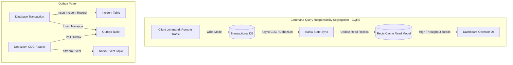

### 1. CQRS (Command Query Responsibility Segregation)
* **Design Decision**: Separate read databases from write databases. High-throughput telemetry writes are routed directly to PostgreSQL/TimescaleDB. System operators query the read model (Redis Cache) for active dashboards.
* **Justification**: Eliminates query bottlenecks during critical match incidents, ensuring that slow, complex historical reports do not degrade real-time telemetry writes.

### 2. Transactional Outbox Pattern
* **Design Decision**: API write transactions commit data to application tables alongside a record in an `outbox` table within the same transaction database. A separate CDC engine (Debezium) polls the outbox and publishes the event to Kafka.
* **Justification**: Guarantees at-least-once message delivery to Kafka without requiring double-writes, preventing database-to-broker consistency drift during networking partitions.

### 3. Saga Pattern (Choreography-based Orchestration)
* **Design Decision**: Distributed transactions across services (e.g., assigning a volunteer, changing digital signage, updating transit) are managed via a Saga pattern. If the volunteer app fails to acknowledge dispatch within 30 seconds, a compensating transaction cancels the signage redirect and selects a secondary volunteer.
* **Justification**: Prevents partial failure scenarios where signage is redirected but no volunteers are dispatched, which could worsen congestion.

---

## 11. Scalability Considerations

To support the massive crowds of the FIFA World Cup 2026, the system handles horizontal scaling, message distribution, database sharding, and LLM optimization.

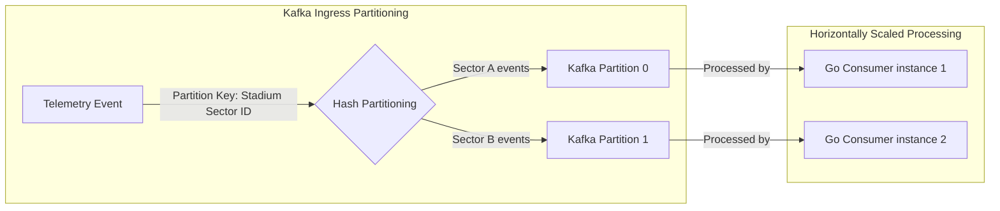

### 11.1 Message Ingress Scaling & Partitioning Strategy
* **Kafka Partition Key**: All incoming metrics are partitioned by `stadium_sector_id` and `gate_id`.
* **Ordering Guarantees**: This design ensures that all telemetry events from a specific gate are handled sequentially by the same microservice consumer instance. This setup prevents race conditions during state evaluation (e.g., calculating running averages).
* **Scaling Consumer Groups**: Consumers are grouped in K8s deployments. If throughput surges, Kubernetes scales up the pods to match the number of partitions.

### 11.2 LLM Optimization & Prompt Cache Architecture
* **Semantic Cache**: A semantic caching layer is placed in front of the LLM Router using Redis. Before sending a query to the cloud LLM, the system computes the embedding of the query and checks if a semantically similar query was processed recently (e.g., "Where is the nearest water station to Sector B?"). If similarity $> 0.96$, it serves the cached response.
* **Prompt Caching**: Long-context templates (such as the stadium SOP documentation) are structured so the static context is placed at the front of the prompt. This allows vLLM and Gemini to reuse KV-cache prefixes, reducing latency by up to 60% and cutting token costs.

---

## 12. Security & Compliance Architecture

The security framework adheres to the **Zero-Trust Network Architecture** to safeguard infrastructure, operational systems, and spectator privacy.

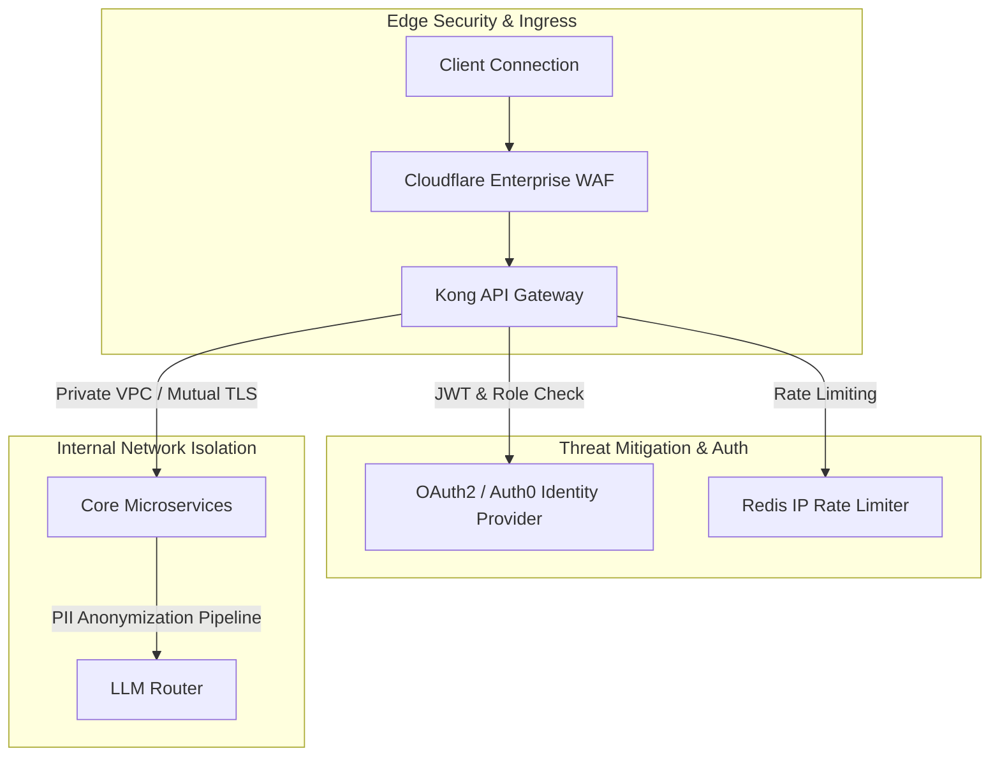

### 12.1 Security Controls and Compliance Design

1. **Role-Based Access Control (RBAC)**:
   * **Spectator / Fan**: Read-only access to paths, public facilities, transit. Zero access to operational dashboards.
   * **Volunteer / Field Staff**: Write access to assign/resolve incidents in their assigned sector. Read access to volunteer-specific tasks.
   * **Chief Security Officer / Admin**: Full read-write access to system parameters, manual signage overrides, and multi-agent directives.
2. **PII and Data Privacy Policy (GDPR / CCPA / HIPAA)**:
   * CCTV analytics output only aggregate counts and occupancy maps to Kafka. The raw video feeds are held locally on secure edge recorders and deleted after 48 hours.
   * Before sending user-submitted text reports to cloud LLMs, a local pipeline runs a prescreener (e.g., using Microsoft Presidio) to strip phone numbers, names, and ticket numbers.
3. **Hardware-Level Security**:
   * All field-deployed IoT devices authenticate via Mutual TLS (mTLS) with certificates stored in dedicated Hardware Security Modules (HSMs) or TPM 2.0 chips on the devices.
   * All API requests are protected by cryptographically signed tokens (ED25519 signatures), preventing replay attacks.

---

## 13. Comprehensive Testing Strategy

To ensure high system reliability, testing spans from standard code tests to system chaos engineering and LLM evaluations.

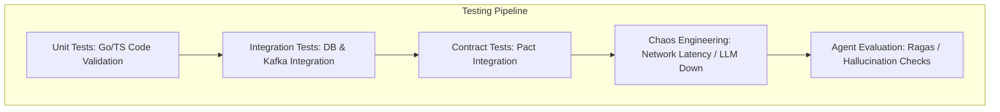

### 13.1 Testing Methodologies & Implementation
* **System Contract Testing (Pact)**:
  * Ensures that API gateway models, event schemas in Kafka (Avro), and agent mesh parameters match. Changes to schema registries block CI/CD pipelines if they break existing consumer endpoints.
* **Chaos Engineering (Chaos Mesh)**:
  * Regularly injects failure scenarios in the staging environment.
  * **Simulation**: Terminate the primary Redis instance, block traffic to the cloud LLM, and simulate a 500ms network latency delay on the IoT Gateway.
  * **Acceptance Criteria**: The system must failover to the local edge model, write telemetry to the TimescaleDB buffer, and handle dashboard updates gracefully without crashing the UI.
* **Agent System Evaluation Pipeline**:
  * Run automated evaluation pipelines using **Ragas** on a gold dataset of 500 simulated emergency scenarios.
  * Measures metrics: **Context Precision** (verifying RAG relevance), **Faithfulness** (ensuring no hallucinations), and **Answer Relevancy**.
  * Any agent version that drops below 0.90 on these parameters is blocked from promotion to production.

---

## 14. Accessibility (a11y) Strategy

To support global visitors at the FIFA World Cup 2026, accessibility is integrated directly into the design of both web and mobile clients.

### 14.1 Key Implementation Design Decisions
1. **WCAG 2.2 AAA Compliance**:
   * **Color Systems**: Dynamic color themes are validated to maintain a minimum contrast ratio of 7:1 for body copy and 4.5:1 for structural UI elements.
   * **Keyboard Navigation**: All interactive features (interactive maps, alarm lists, routing selections) are fully accessible via keyboard (`tab`, `enter`, `escape` keys) with distinct focus rings.
2. **Audio Assistance (Screen Readers & TTS)**:
   * Screen readers receive structural updates via semantic ARIA landmarks and dynamic live alerts (`aria-live="polly"` and `aria-live="assertive"` for emergency notifications).
   * Voice interaction: Integrates native device Speech-To-Text (Whisper) for voice navigation, allowing users with mobility impairments to query facilities hands-free.
3. **Multilingual Architecture**:
   * The Translation Agent dynamically translates operational updates and notifications into the user’s preferred language (supporting all 32 tournament participant languages).
   * RAG manuals are stored and queried using multilingual embedding models (`multilingual-e5-large`), allowing volunteers to access guidelines in their native language regardless of the original document language.

---

## 15. Deployment & Infrastructure Architecture

The deployment architecture uses a **Hybrid Cloud-Edge Infrastructure** design, providing cloud scale alongside edge resilience if stadium internet connectivity is lost.

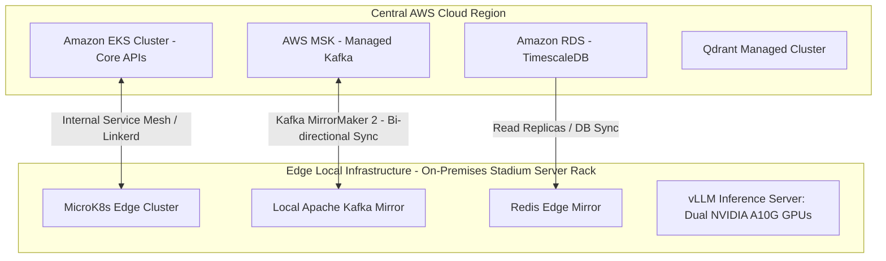

### 15.1 Deployment & Infrastructure Details
* **Infrastructure as Code (IaC)**: Organized in Terraform, segregating resources by environment (`/staging`, `/prod`) and provider (`/cloud`, `/edge`).
* **High Availability (HA)**:
  * Deployments are configured across 3 Availability Zones (AZ) in AWS.
  * Local Edge nodes feature dual-redundant power supplies and are connected to local battery backups (UPS).
* **Network Partition & Edge Autonomy (Offline Mode)**:
  * If the primary internet fiber link is severed, the stadium's local MicroK8s cluster takes over gateway routing automatically.
  * Ingress events continue streaming to the local Kafka mirror.
  * Reasoning tasks route to the local `vLLM` server running Llama-3-8B.
  * Dashboard commands execute locally. When the internet connection is restored, MirrorMaker syncs local data back to the cloud.
* **Observability (Prometheus, Grafana, OpenTelemetry)**:
  * **Traces**: OpenTelemetry traces spans across microservices and agent graph runs, tracing requests from turnstile metrics to agent decisions.
  * **Metrics**: Grafana dashboards monitor ingestion rates, WebSocket queue depths, Redis memory utilization, and LLM token latencies.
  * **Logs**: Vector agents collect logs across containers and route them to a central Grafana Loki cluster.
