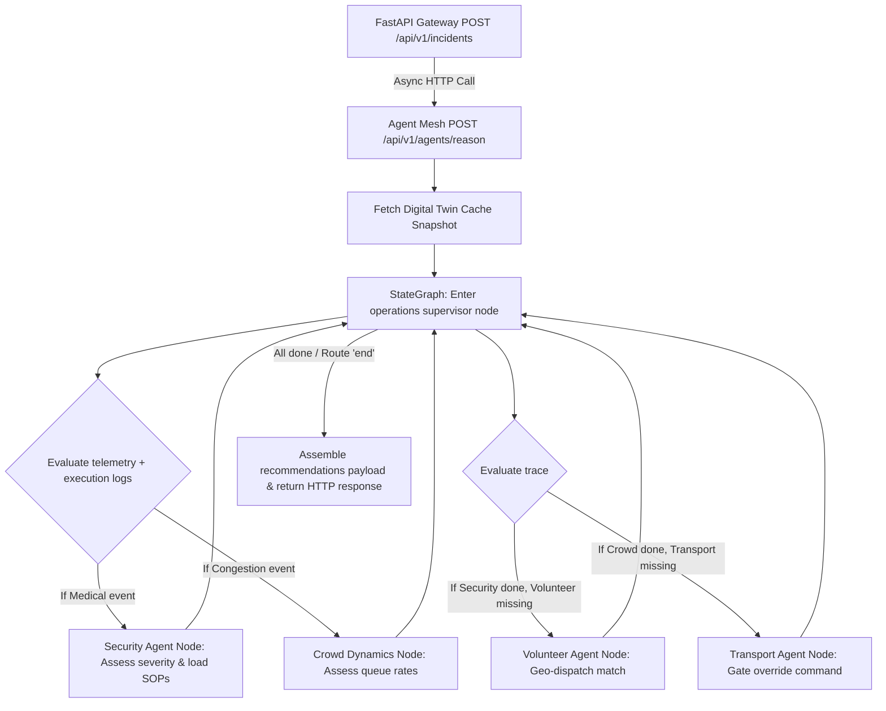

# StadiumOS AI — Unified Platform Walkthrough

We have successfully built the complete backend and agent orchestration infrastructure for **StadiumOS AI**, composed of two decoupled microservices running inside a containerized local stack.

---

## 1. Directory Structure & Decoupled Boundaries

The codebase is split into two optimized, independent services inside the monorepo workspace:

```
stadiumos-dir/
├── apps/
│   ├── backend-gateway/         # Python/FastAPI Gateway
│   │   ├── src/                 # Database, cache clients, auth, and REST API routers
│   │   ├── Dockerfile
│   │   └── docker-compose.yml   # Dev orchestration (DB + Redis + Gateway + Agent Mesh)
│   │
│   └── agent-mesh/              # TypeScript/LangGraph reasoning server
│       ├── src/
│       │   ├── config.ts        # Agent mesh setting parsing
│       │   ├── server.ts        # Express endpoints running LangGraph executions
│       │   ├── state/
│       │   │   └── graphState.ts# Zod schemas mapping shared orchestrator state
│       │   ├── agents/          # Specialist agent nodes (Operations, Crowd, Transport, Security, Volunteer)
│       │   ├── graphs/
│       │   │   └── orchestrator.ts# LangGraph StateGraph builder & conditional router
│       │   └── services/
│       │       ├── llmProvider.ts# LLM model client provider (Gemini / OpenAI / Sandbox Mock)
│       │       ├── qdrantRAG.ts  # Qdrant client with offline fallback SOP guidelines
│       │       └── toolService.ts# REST tools client updating backend-gateway database
│       └── Dockerfile
```

---

## 2. Multi-Agent Reasoning Graph & Flow

The AI system inside `apps/agent-mesh` compiles a stateful LangGraph mapping the following logical flow:



---

## 3. High-Performance Tool calling & Local Mock fallbacks

To ensure absolute resilience during testing, hackathon judging, and offline local operations, we built **intelligent fallback adapters** across the infrastructure:

- **Mock LLM Provider (`llmProvider.ts`)**: If Gemini/OpenAI API keys are unconfigured, the system automatically swaps the model with a `SandboxMockLLM` that inspects queries and parses correct schema-compliant recommendations.
- **RAG Failsafe SOPs (`qdrantRAG.ts`)**: If Qdrant is offline or unseeded, the service logs warnings and returns static, high-grade safety guidelines (e.g. `[SOP_04_MEDICAL_EMERGENCY]`, `[SOP_12_SECURITY_HAZARD]`) based on incident classification.
- **REST Tool Client (`toolService.ts`)**: Bypasses public gateway rate-limits via internal keys (`X-Internal-Service-Key`), updating databases and Redis caches asynchronously.

---

## 4. Quick-Start Orchestration

### 1. Build and boot the stack
Run the command below from the `apps/backend-gateway` folder:
```bash
docker compose up -d --build
```
This boots 4 services inside a private virtual bridge network:
1. `stadiumos-postgres` (Postgres 16 + TimescaleDB extension for telemetry hypertables)
2. `stadiumos-redis` (Redis 7 alpine for geospatial volunteer index and Digital Twin caching)
3. `stadiumos-api` (FastAPI backend server running on port `8000`)
4. `stadiumos-agent-mesh` (Express / LangGraph server running on port `8001`)

### 2. Verify endpoints
- **API Docs**: [http://localhost:8000/docs](http://localhost:8000/docs)
- **Agent Health**: [http://localhost:8001/health](http://localhost:8001/health)
